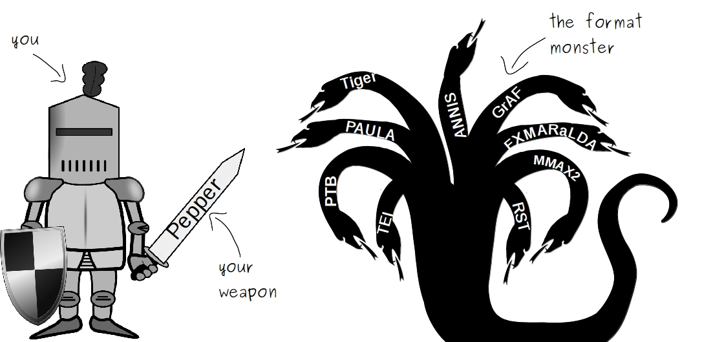

# About Pepper
 If you need to convert corpora from one linguistic format into another, Pepper is your swiss-army knife. When your annotation tool produces a different data format from the one your analysis tool can read, Pepper is there to the rescue.

* Pepper can convert documents in a variety of linguistic formats, such as: EXMARalDA, Tiger XML, MMAX2, RST, TCF, TreeTagger format, TEI (subset), ANNIS format, PAULA and many many more.
* Pepper comes with a plug-in mechanism which makes it easy to extend it for further formats and data manipulations.
* Pepper is module-based, each mapping is done by a separate module. This enables each module to be combined with every other module in one single workflow.
* Pepper uses the intermediate model Salt, which reduces the number of mappings to convert n into m formats.
* Pepper modules, such as the MergingModule, allow to merge the data from different annotation tools together and create multilayer corpora.
* Pepper can be used as an interactive command line tool, as a command to be included in scripts, or as an API to be integrated in other software products.
* Pepper is written in Java and can be run on all operation systems which are ready to run Java (Windows, Mac, Linux, Unix, ...).
* Pepper is free and open source software. It is distributed under the Apache License, Version 2.0.

# Want to know more?

* Homepage: http://corpus-tools.org/pepper
* Code: https://github.com/korpling/pepper
* Bug and issue tracking: https://github.com/korpling/pepper/issues
* Code documentation for people who want to use Pepper as a library, who want create their own Pepper module or who want to take part in the Pepper development 
 * stable version: https://korpling.github.io/pepper/doc/
 * snapshot version: https://korpling.github.io/pepper/doc-snapshot/
