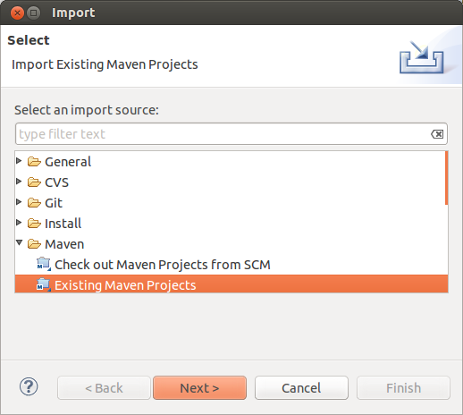

Run your first Pepper module
============================

If you do not belong to the hardcore 'vi' developer community, you may want to use a development environment and an IDE for implementing your Pepper module. For that case we here describe how to set up your environment for the Eclipse IDE (see: <http://download.eclipse.org>). You also can stick to another IDE like NetBeans (see: [www.netbeans.org/](www.netbeans.org/)) but you should make sure that the OSGi framework is set up correctly for your IDE. In that case, skip the Eclipse specific parts.

Setting Up
==========

1.  Download Eclipse [1]

2.  Unzip the Eclipse archive to a location of your choice, lets call it ECLIPSE\_HOME

3.  Download the latest version of Pepper (<https://korpling.german.hu-berlin.de/saltnpepper/repository/saltNpepper_full/>)

4.  Unzip SaltNPepper to a location of your choice, let's call it PEPPER\_HOME.

5.  Copy all files from PEPPER\_HOME/plugins to ECLIPSE\_HOME/dropins

6.  When you now open Eclipse, a menu will pop up and asks for a workspace location. Point the location to a folder of your choice. Let's call it WORKSPACE. Now you have an empty Eclipse. [2]

7.  Since SaltNPepper uses Maven (see: <http://maven.apache.org/>) for dependency and lifecycle management, it would make things much easier, to install Maven in your Eclipse environment.

8.  Open the 'Eclipse Marketplace' via 'Help' --\> 'Eclipse Marketplace...' (see ?)

    

9.  Type in *maven* in text box 'Find:' and press enter (see ?).

10. The plugin 'Maven integration for Eclipse' should be displayed (you may have to scroll down). Click "Install" to install that plugin (see ?).

11. During the installation Eclipse asks you to agree to the license of this plugin and it may be recommended to restart Eclipse. Just follow the instructions and go ahead.

12. For an easier start, we provide a sample project which could be used as a template for your own Pepper modules. This project contains in importer, a manipulator and an exporter. The sample project is available via the versioning control system of Pepper and can be downloaded using SVN[3] with the command:

        svn export https://github.com/korpling/pepper/trunk/pepper-sampleModules

    Download the project to a location of your choice, let's call it SAMPLE\_HOME.

13. Back in Eclipse, click on the menu item 'File' --\> 'Import...'. When the Maven integration for Eclipse was set up correctly, you will find an entry named Maven in the popped up dialog.

14. Click the entry 'Existing Maven Projects' as shown in figure ?.

    

15. In the opening wizard choose SAMPLE\_HOME as location of your Maven project and first click 'Next' than 'Finish'. Eclipse may asks you to install 'Tycho'[4]. Installing tycho and the necessary connectors could take some time.

16. Now Eclipse should import your first Pepper module project. After all, your Eclipse should look very similar to figure ?). On the left hand side, you can see all active projects in your workspace (which currently is just the pepperModules-SampleModules project). When you open the project (by double-clicking), you can see all files and folders of this project.

Let's have a first run
======================

To run a project in Eclipse, you need a configuration of what should be run and how it should be run. This is called a run configuration.

1.  Before you can run the sample module, you need to compile its sources. Since Pepper is using Maven, right click on the project and select 'Run as...' --\> 'Maven Install'.[5]

2.  To open the run configuration dialog, click on the small arrow on the right of the 'play' symbol (see position 1 in figure ?) and choose menu entry 'Run Configurations...'. Alternative you can click on 'Run'--\> 'Run Configurations...'.

    

3.  Double-click on the entry 'OSGi Framework', a subentry named 'run\_sampleProject' will be opened (similar to figure ?)[6]. Double-click on that entry.

4.  Now switch to the tab 'Environment'. You will find the definition of an environment variable named 'PEPPER\_TEST\_WORKFLOW\_FILE'. The value of this variable determines, where to find the description file of a Pepper workflow (see figure ?). The sample module comes with a predefined workflow file at 'SAMPLE\_HOME/src/test/resources/sample.pepperparams'. In this workflow all three modules of the sample module project are in use: an importer for importing a static corpus, a manipulator, to print out some information about the corpus like annotation frequencies and an exporter to export the corpus into dot format.[7]

    Replace the entry with an absolute path to that file.

5.  For logging, Pepper uses the SLF4J framework (see: <http://www.slf4j.org/>). Switch to tab 'Arguments' and in text box 'vm arguments' add the flag '-Dlogback.configurationFile=SAMPLE\_HOME/src/test/resources/logback\_test.xml' (if it is not already there). Make sure to replace SAMPLE\_HOME with an absolute path.

6.  Now press the button 'Run'.

7.  In optimal case everything is fine and Pepper should welcome you and start the conversion producing some outputs to standard out. So what has happened?

    1.  The framework starts and notifies about the registered modules, which are some more, than just our sample modules. This is because you copied all modules to the Eclipse dropin path.

    2.  Pepper lists the workflow as defined in the workflow file.

    3.  The SampleImporter imports a predefined corpus and logs some status messages to its progress.

    4.  The SampleManipulator outputs some statistical information about that imported corpus like, how many nodes and relations are contained. Which annotations are used and in which frequency they occur.

    5.  The SampleExporter exports that corpus in dot format to the path 'SAMPLE\_HOME/target/sampleModuleOutput'.

Let's give the baby a name
==========================

... and configure the project. Configuring means, to adapt the default configurations to your specific project needs like the name of your project, its purpose, the name of your organization and so on.

1.  **project structure**

    -   Rename the sample project to a name of your choice like 'pepperModules-MyModules' (when working with Eclipse, right click on the project name and choose the menu entry "Refactor" --\> "Rename...")

    -   Rename the packages (when working with Eclipse, right click on the package name and choose the menu entry "Refactor" --\> "Rename...")

2.  **pom.xml**

    Open the pom.xml in the sample project by double clicking on it. A specific editor the 'POM editor' will open. On the bottom, a set of tabs is visible, choose the tab 'pom.xml'. An xml editor will open the pom.xml file. Here you will find a lot of outcommented 'TODO' lines. These comments are explanations to the following lines and guide you what could/ should be changed. In the following, this document also gives a description of what to be changed and addresses the xml element with the use of the XPath syntax.

    -   Change the "groupId" to the name of your working group (conventionally, the groupId is the same as the package name). You will find the entry under '/project/groupId'.

    -   Change the "artifactId" (to the module name). You will find the entry under '/project/artifactId'.

3.  **Java code**

    We recommend to delete the modules you do not want to implement for this time and just to keep the one(s) you are currently needing[8].

    -   Change the name of the module, for instance to *MyImporter*, *MyExporter* etc. We recommend to use the formats name and the ending Importer, Exporter or Manipulator.[9]

    -   Change the components name[10], for instance use the classes name and add 'Component' to it (e.g. *MyImporterComponent*) like in the following example.

            @Component(name="MyImporterComponent", 
                       factory="PepperImporterComponentFactory")
            public class MyImporter extends PepperImporterImpl 
                                        implements PepperImporter

That have been all required changes to be made. But as you might have seen, a pom.xml contains a lot more entries to describe your projects. Some of these entries are very useful, depending on the Maven modules you want to use. Here we shortly describe how to adapt the optional entries, we have used in the sample project. You can also do the following adaptions later and skip them for now.

-   Modify the description: Write what the module is supposed to do. You will find the entry under '/project/description'.

-   Change the project homepage to the url of your project. You will find the entry under '/project/url'.

-   Change the issue tracker to the one you are using, in case that you do not use any one, remove this entry. You will find the entry under '/project/issueManagement'.

-   Change the continuous integration management system to the one you are using, in case that you do not use any one, remove this entry. You will find the entry under '/project/ciManagement'.

-   Change the inception year to the current year. You will find the entry under '/project/inceptionYear'.

-   Change the name of the organization to the one you are working for. You will find the entry under '/project/organization'.

-   Modify the scm information or remove them (the scm specifies the location of your versioning repository like SVN, GIT, CVS etc.). You will find the entry under '/project/scm'.

-   Change the connection to the tags folder of your scm, what you can see here is the subversion connection for the pepperModules-SampleModules project. You will find the entry under '/project/build/plugins/plugin/configuration/tagBase'.

-   If your module needs some 3rd party Maven dependencies add them to the dependencies section. (adding 3rd party dependencies is necessary to resolve them via Maven). You will find the entry under '/project/dependencies'.

-   Sometimes it is necessary to include libraries, which are not accessible via a Maven repository and therefore can not be resolved by Maven. In that case we recommend, to create a 'lib' folder in the project directory and to copy all the libraries you need into it. Unfortunately, you have to register them twice, first for Maven and second for OSGi.

    To register such a library to Maven, you need to install them to your local Maven repository. You can do that with:

        mvn install:install-file -Dfile=JAR_FILE -DgroupId=GROUP_ID \
        -DartifactId=ARTIFACT_ID -Dversion=VERSION -Dpackaging=PACKAGING
                            

    Now you need to add the library as a dependency to your pom. The following snippet shows an example:

        <dependency>
          <groupId>GROUP_ID</groupId>
          <artifactId>ARTIFACT_ID</artifactId>
          <version>VERSION</version>
        </dependency>
                            

    To make them accessible for OSGi, add them to the bundle-classpath of the plugin named 'maven-bundle-plugin'. You will find the entry under '/project/build/plugins/plugin[artifactId/text()= 'maven-bundle-plugin']/configuration/instructions/Bundle-ClassPath'. You further need to add them to a second element named include-resource, which you will find under '/project/build/plugins/plugin[artifactId/text()= 'maven-bundle-plugin']/configuration/instructions/Include-Resource'. The following snippet gives an example:

        <Bundle-ClassPath>.,{maven-dependencies}, lib/myLib.jar</Bundle-ClassPath>
        <Include-Resource>{maven-resources}, LICENSE, NOTICE, 
        lib/myLib.jar=lib/myLib.jar</Include-Resource>
                            

    You include libraries not handled by Maven, i.e. jar files, by setting the bundle-path and extending the include-resources tag. "/project/build/plugins/plugin[artifactId/text()= 'maven-bundle-plugin']/configuration/instructions/Include-Resource"

Let's have a second run
=======================

Since your project's configuration is now adapted to your needs, you need to re-compile the sources. Right click on the project and select 'Run as...' --\> 'Maven Install'. After renaming the project in Eclipse and the pom.xml, you need to adapt the 'Run configurations'.

1.  In tab 'Bundles' you need to select the bundle again (having the new name).

2.  In the tab 'Arguments' you need to adapt the reference to the SLF4J configuration file, by replacing the folder SAMPLE\_HOME with the new projects name (-Dlogback.configurationFile=SAMPLE\_HOME/src/test/resources/logback\_test.xml).

3.  And the same goes for 'Environment', where you have to adapt the location of the WORKFLOW\_DESCRIPTION\_FILE reference.

Pepper also needs to know about the name change of the modules, therefore you need to adapt the workflow file under 'SAMPLE\_HOME/src/test/resources/sample.pepperparams'.

1.  Change the name of the modules and/or the format descriptions.

2.  In case you have removed some modules, delete them from the workflow file.

Now your own Pepper module hopefully is able to run inside the Eclipse framework. If not please check the SaltNPepper homepage under [u.hu-berlin.de/saltnpepper](u.hu-berlin.de/saltnpepper) or write an e-mail to <saltnpepper@lists.hu-berlin.de>.

For creating a deliverable assembly of your project, to be plugged into the Pepper framework. Open a command line and run: mvn clean install assembly:single Or use Eclipse by right clicking the project and then click 'Run as' --\> 'Maven build...'. In form field 'Goals' type in 'clean install assembly:single'.

This will create a zip file in the target folder of your project 'SAMPLE\_PROJECT/target/distribution', which can simply be plugged into Pepper via extracting its content to the plugin folder of Pepper 'PEPPER\_HOME/plugins'.

> **Note**
>
> If the command 'mvn' was not found, make sure Maven is also installed for system-wide use and not only in Eclipse. For more information see the Maven site <http://maven.apache.org/>.

Congratulations
===============

Now you are done, a new Pepper module is running under your name and you can provide it for download. So the work is done, is it? Unfortunately not, now we come to the hardest part ;-), the coding of your tasks. But don't be afraid, the next chapter is supposed to guide you through the jungle and to not losing your path.

[1] Eclipse is available in several flavors e.g. for web developers, mobile developers, C++ developers etc. We recommend the Eclipse Modeling Tools, since you might want to create or use a model for the format you want to support. In this documentation, we used Eclipse kepler, version 4.3.1 (see: <http://www.eclipse.org/downloads/packages/eclipse-standard-431/keplersr1>).

[2] When starting Eclipse for the first time, the first you will see is a welcome tab, just close this tab.

[3] For downloading the sample via SVN, you need an SVN client. Clients are available for all main OS. Most linux distributions already come with a command-line SVN client, also for Windows command-line clients are available, but even the very nice graphical client TortoiseSVN (<http://tortoisesvn.net/>) is available.

[4] Tycho is an Eclipse plug-in to connect the Maven integration with OSGi projects (see: <http://www.eclipse.org/tycho/>).

[5] The project now should be compiled. If you cannot see the compilation progress, you need to open the 'Console' view by clicking on 'Window'--\>'Show View'--\>'Console'

[6] If this entry does not appear, open the file 'SAMPLE\_HOME/src/test/resources/run\_sampleProject.launch' by double clicking

[7] The dot format (see: <http://www.graphviz.org/content/dot-language>) is a format for rendering graphs. This format can be converted with for instance the GraphViz tool (see: <http://www.graphviz.org/>) into a svg, png or another graphical format.

[8] Otherwise your project will mess up with non-functional modules.

[9] Renaming the modules is important, when you want to use your modules together with others in Pepper. A user will not find your module, when every module has the name SampleImporter.

[10] a component here is an OSGi service component (for more details see <http://wiki.osgi.org/wiki/Declarative_Services>)
